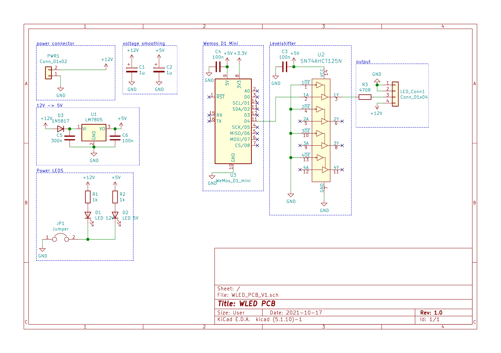
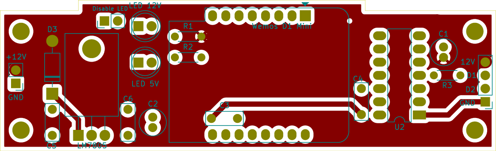
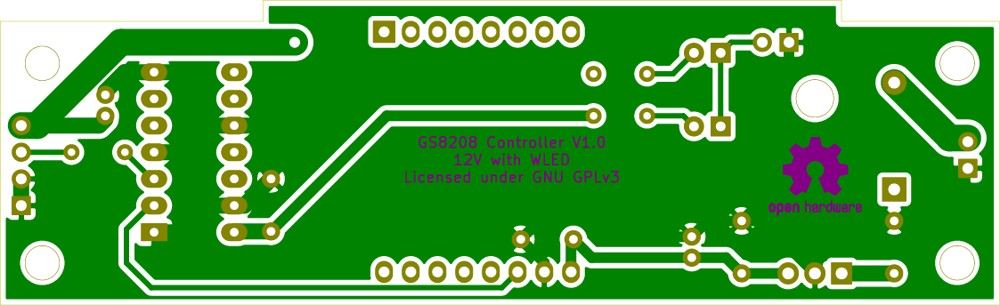
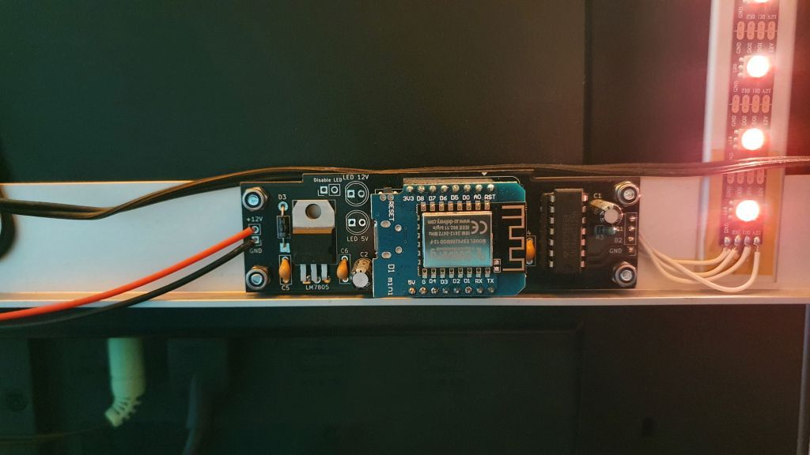
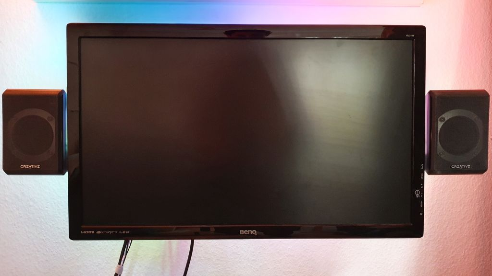
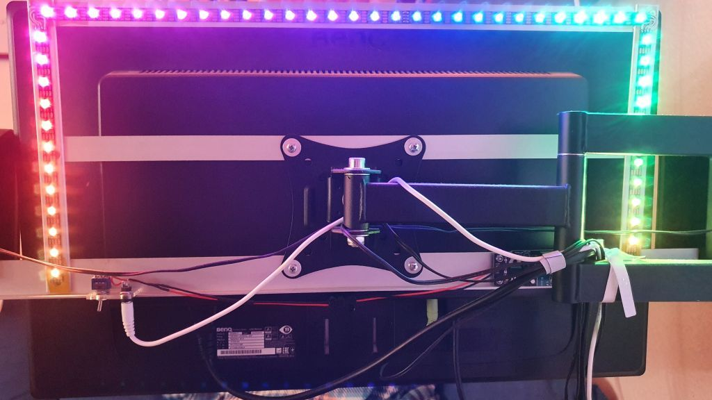
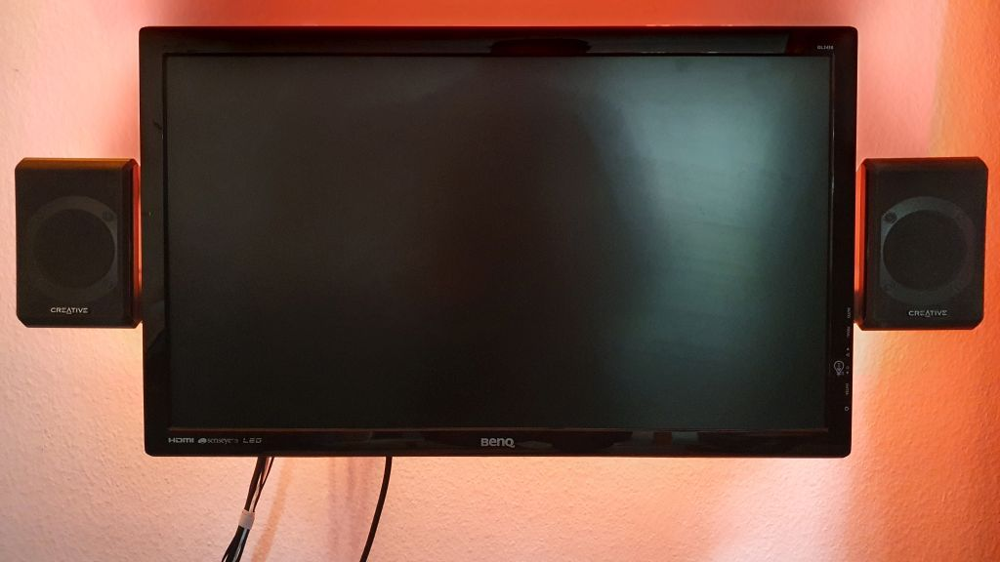
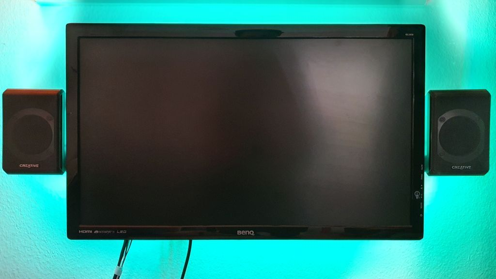
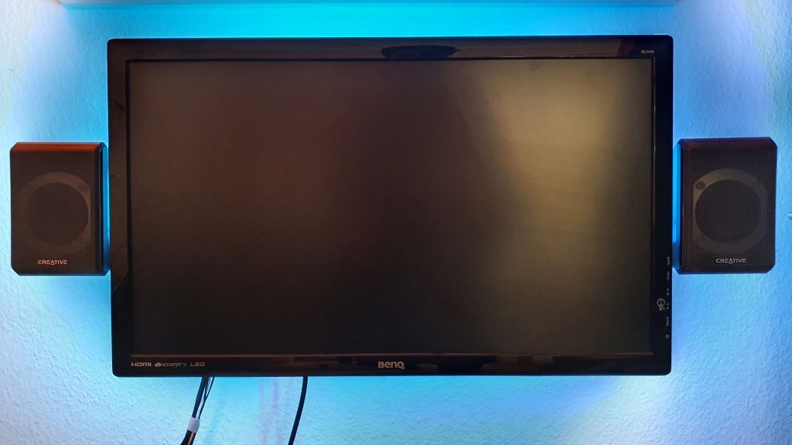

# WLED PCB V1

This PCB is outdated and I can no longer recommend using it. Please use [WLED-PCB-V2](https://github.com/jhns-de/WLED-PCB-V2) instead. It has much more safety features.

## Summary
This is a PCB to control a 12V [GS8208](http://www.normandled.com/upload/201805/GS8208%20LED%20Datasheet.pdf) LED Stripe with [WLED](https://github.com/Aircoookie/WLED).
The PCB contains a voltage regulator to provide 5V for the Wemos D1 mini and a level shifter for the signal line.
Furthermore, the PCB is designed so that it goes directly inbetween the power supply and the LED Stripe.

This project is for an external ambilight solution for a VESA mounted monitor. Therefore the width of the PCB is given by the L-profile where the PCB is mounted on.

**This PCB was designed in [KiCad](https://www.kicad.org/).**

## Schematic

### Partlist

| Quantity | Reference | Part | Footprint | Function |
|----------|-----------|------|-----------|----------|
| 2  | C1, C2 | 1u Capacitor | D5.00mm P2.00mm | voltage smoothing |
| 3 | C3, C4, C6 | 100n Capacitor | L7.0mm P5.00mm | voltage smoothing |
| 1 | C5 | 300n Capacitor | L7.00mm P5.00mm | voltage smoothing |
| 2 | D1, D2 | 5mm LED |  | Check if 12V and 5V are available |
| 1 | D3 | 1N5817 Diode |  | reverse polarity protection |
| 2 | R1, R2 | 1k Resistor | L3.6mm THT | series resistor for LED |
| 1 | R3 | 470R Resistor | L3.6mm THT | series resistor for data line |
| 1 | U1 | LM7805 | TO-220 | voltage regulator |
| 1 | U2 | SN74AHCT125N | DIP-14 | levelshifter for data line |
| 1 | U3 | WeMos D1 Mini |  | Controller |

### Recommended Parts

**These are the parts I used.**
*The following links are affiliate links!*

- [1u Capacitor](https://amzn.to/3BVUkxN)
- [100n Capacitor](https://amzn.to/3lNCLui)
- [1N5817 Diode](https://amzn.to/3vk3HEU)
- [LM7805](https://amzn.to/3pdkVmA)
- [SN74AHCT125](https://amzn.to/3jerAca)
- [WeMos D1 Mini **compatible board**](https://amzn.to/2Z43ZnQ)

## PCB

Order the PCB [here](https://www.pcbway.com/project/shareproject/WLED_PCB_V1.html) from PCBWay.

### Front

### Back

## Images

## License

This project is licensed under the GNU GPLv3.
